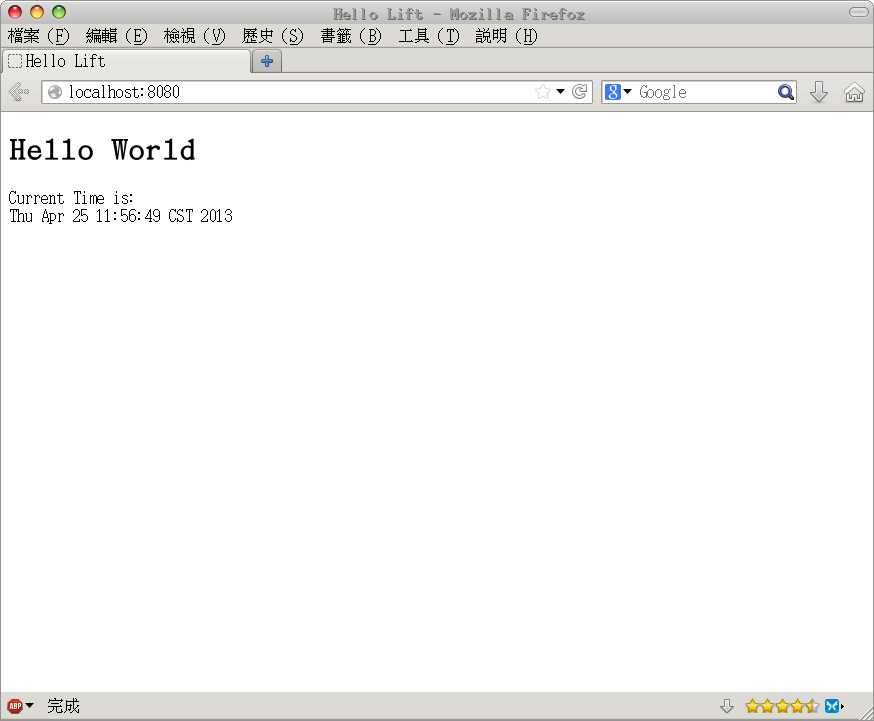

從零開始建立第一個 Lift 程式
#############################

Lift 並沒有預設的建置環境，並且使用標準的 Maven 格式發佈函式庫 JAR 檔，以及可以運行在標準的 Java Web Container 上，因此你可以使任何的建置系統與 Web Container 來做為開發的環境。

在這個 Tutorial 中，我們會使用在 Scala 社群中最常使用的 `SBT`_ 建置系統以及其使用 `Jetty`_ 做為 Web Container 的 `SBT Web Plugin`_ 來當做開發環境。

前置需求
===================

由於不論是 Scala / Lift 或是我們所使用的 SBT 建置系統，均使用 Java Virtual Machine 做為執行環境，因此您至少要有 Java 1.5 以上的 Java 執行環境。

若您不確定您是否有合適的 Java 執行環境，或者目前所使用的版本，您可以在您的終端機視窗（若是在 Windows 上的話就是命令提示字元）輸入下列指令：

.. code-block:: console

    java -version

若您的機器上有安裝 Java 執行環境的話，您應該會看到類似下列的訊息，告知您目前您所使用的 Java 環境版本，只要第一行的版本是 1.5 以上就可以了。

.. code-block:: console

    java version "1.7.0_17"
    Java(TM) SE Runtime Environment (build 1.7.0_17-b02)
    Java HotSpot(TM) 64-Bit Server VM (build 23.7-b01, mixed mode)

若您發現出現錯誤訊息，很有可能是因為您並未正確地安裝 Java 執行環境，您可以到 `Java 官方網站`_\ 下載並依照指示安裝 Java 執行環境。

安裝 SBT 與建立基本專案目錄
===========================

SBT 是 Simple Build Tool 的簡稱，是目前在 Scala 生態系統中相當成熟並且受歡迎的建置系統。由於 SBT 本身就支援引入 Maven 套件庫裡的函式庫，因此使用 SBT 可以讓我們更快速地來建置我們的專案，並省去自行維護相依性的工作。

安裝 SBT 建置系統
---------------------

在這一小節，我們會介紹如何安裝 SBT，在這份文件中我們會以 SBT 0.12.3 做為我們的建置系統。

首先，請依下列的步驟執行：

1. 連線至 `SBT Download`_ 頁面
2. 依照您的作業系統下載並按上述網頁的指示安裝 SBT

  - 若您的作業系統是 Linux / MacOS，您可以直接下載 `TGZ`_ 檔案，並將其解壓縮到 ``/opt`` 後把 ``/opt/sbt/bin`` 加入您的 ``PATH`` 環境變數中即可。
  - 若您的作業系統是 Windows，您可以下載 `MSI`_ 檔案並點兩下安裝。

Lift 專案目錄的架構
---------------------

在 SBT 當中，一個專案就是一個檔案系統中的目錄，並且遵照特定的檔案與目錄節構，一個典型的 Lift 應用程式，會具有如下的目錄節構：

.. code-block:: console

    LiftProject                         // Lift 專案目錄
    ├── build.sbt                       // SBT 設定檔
    ├── project
    │   └── plugins.sbt                 // SBT Plugin 設定檔
    └── src
        └── main
            ├── scala
            │   ├── code                // 應用程式程式碼目錄
            │   │   ├── comet           // Lift Comet 程式碼
            │   │   ├── model           // Lift Model 程式碼
            │   │   ├── snippet         // Lift Snippet 程式碼
            │   │   └── view            // Lift View 程式碼
            │   └── bootstrap
            │       └── Boot.scala      // Lift 設定檔
            └── webapp                  // 網頁模版目錄
                ├── index.html          // 首頁
                └── WEB-INF             // Web Container 設定目錄
                    └── web.xml
    
若您用過其他的 MVC 網頁框架，您可能會發現這樣的目錄編排和其他的網頁應用程式框架不太相同，例如在 Lift 的專案當中沒有 ``controller`` 這個目錄，但相反的多了 ``comet`` 和 ``snippet`` 這兩個目錄。

另一點值得注意的，是在 Lift 專案中，我們的網頁模版會放在 ``src/main/webapp/`` 這個目錄底下，而 ``src/main/scala/code/view/`` 雖然也是放置 ``View`` 的程式碼，但這裡的 ``View`` 主要是指如 XML / JSON 這類直接使用程式碼產生的格式。

在 ``src/main/scala/code/view/`` 裡的程式碼，就是負責透過程式化的方式生成 XML / JSON 回應，而我們的網頁模版是放在 ``src/main/webapp/`` 目錄當中。

其他目錄的功用，我們會在使用到的時候再仔細說明，現在您只需要知道一個 Lift 專案的目錄的大致架構便已足夠。

建立 HelloWorld 專案目錄
----------------------------

這一節我們會建立起一個最基本的，內含有 Jetty 網頁伺服器的 SBT 專案，並且將 Jetty 伺服器跑起來，確認我們至少有一個可以放置靜態網頁的網頁伺服器。

一開始，我們先建立下列幾個目錄：

  - HelloWorld
  - HelloWorld/project
  - HelloWorld/src/main/scala/code/snippet
  - HelloWorld/src/main/scala/bootstrap
  - HelloWorld/src/main/webapp
  - HelloWorld/src/main/webapp/WEB-INF

若您使用 Linux / MacOS 的話，可以直接在終端機視窗中使用下列的指令建立這個目錄：

.. code-block:: console

    $ mkdir -p HelloWorld/project
    $ mkdir -p HelloWorld/src/main/code/snippet
    $ mkdir -p HelloWorld/src/main/code/bootstrap
    $ mkdir -p HelloWorld/src/main/webapp/WEB-INF

若您使用的是 Windows 的話，請使用檔案管理員建立相對應的目錄。

接著編輯 ``HelloWorld/project/plugins.sbt`` 這個檔案，將 `SBT Web Plugin`_ 引入我們的專案中，如此一來我們才會有內建的 Jetty 伺服器做為程式開發時的 HTTP Server。

該檔案的內容如下：

.. code-block:: scala

    // HelloWorld/project/plugins.sbt

    libraryDependencies += "com.github.siasia" %% "xsbt-web-plugin" % "0.12.0-0.2.11.1"

最後我們要編輯 ``HelloWorld/build.sbt`` 這個檔案，設定此 Lift 專案的基本資訊：

.. code-block:: scala

    organization := "org.yourorg"   // 你的專案的 organization 設定
    
    name := "HelloWorld"            // 專案名稱
    
    version := "0.1-SNAPSHOT"       // 專案版本
    
    scalaVersion := "2.10.0"        // 欲使用的 Scala 版本
    
    seq(webSettings :_*)            // 使用預設的 SBT Web Plugin 設定

    libraryDependencies ++= Seq(    // 引入 Jetty 伺服器至專案相依性中
      "org.eclipse.jetty" % "jetty-webapp" % "8.1.7.v20120910"  % "container,test"
    )

編寫完上術設定檔後，我們可以使用下列的指令來進入 SBT 的命令列環境中：

.. code-block:: console

    $ cd HelloWorld
    $ sbt

若一切正常無誤，您會看見類似下列的訊息，告知您 SBT 正在抓取所需要的檔案。第一次使用 SBT 時，此過程會花費較長的時間，請耐心等候。

.. code-block:: console

    brianhsu@USBGentoo ~/HelloWorld $ sbt
    Getting net.java.dev.jna jna 3.2.3 ...
    downloading http://repo1.maven.org/maven2/net/java/dev/jna/jna/3.2.3/jna-3.2.3.jar ...
            [SUCCESSFUL ] net.java.dev.jna#jna;3.2.3!jna.jar (12820ms)
    :: retrieving :: org.scala-sbt#boot-jna
            confs: [default]
            1 artifacts copied, 0 already retrieved (838kB/22ms)
    Getting org.scala-sbt sbt 0.12.3 ...

等到一切都完成後，SBT 會如下所示，出現 ``>`` 的提示符號，告知您已經準備就緒，進入了 SBT 的建置環境，可以開始接受指令了。

.. code-block:: console

    [info]  [SUCCESSFUL ] org.eclipse.jetty#jetty-io;8.1.7.v20120910!jetty-io.jar (1746ms)
    [info] Done updating.
    > 

出現這個訊息之後，請輸入 ``container:start`` 來將 Jetty 網頁伺服器啟動：

.. code-block:: console

    > container:start
    [info] jetty-8.1.7.v20120910
    [info] NO JSP Support for /, did not find org.apache.jasper.servlet.JspServlet
    [info] started o.e.j.w.WebAppContext{/,[file:/home/brianhsu/HelloWorld/src/main/webapp/]}
    [info] started o.e.j.w.WebAppContext{/,[file:/home/brianhsu/HelloWorld/src/main/webapp/]}
    [info] Started SelectChannelConnector@0.0.0.0:8080
    [success] Total time: 0 s, completed 2013/4/24 下午 03:32:28

接著我們可以連線到 http://localhost:8080/ 此網址，會看到如下的畫面，這是由於我們沒有的 ``HelloWorld/src/main/webapp/`` 目錄仍然是空的，也沒有提供任何有效的網頁，因此 Jetty 預設會顯示出一個空的目錄列表。

.. figure:: img/01-01.png
    :width: 800
    :align: center

    預設的 Jetty 頁面

在 SBT 中除了可以使用 ``container:start`` 來啟動 Jetty 網頁伺服器外，也可以使用其他指令。以下是在這個 Tutorial 中我們會使用到的指令列表，以及其作用：

======================     ===================================
    指令                                作用
======================     ===================================
 compile                      編譯 Java / Scala 程式碼
 container:start              啟動 Jetty 伺服器
 container:stop               停止 Jetty 伺服器
 container:reload /           重新啟動 Jetty 伺服器
 reload                       重新讀取 SBT 專案設定檔
 update                       重新抓取相依性函式庫套件
======================     ===================================

建立第一個 Lift 專案
======================

在這一節中，我們會把剛剛建立的專案目錄變成一個 Lift 專案，並且實作下述的功能：

- 這個網站只有首頁
- 當使用者進到網站時，會顯示招呼語與目前的時間

指定 Lift 的版本與專案相依性
-------------------------------

在確認 Jetty 伺服器可以運作後，接下來我們要把 Lift 的函式庫加到我們的專案中，這個步驟相當簡單，請將 ``HelloWorld/build.sbt`` 中 ``libraryDependencies`` 設定相依性的部份修改成下面的程式碼：

.. code-block:: scala

    libraryDependencies ++= Seq(    // 引入 Jetty 伺服器至專案相依性中
      "org.eclipse.jetty" % "jetty-webapp" % "8.1.7.v20120910"  % "container,test",
      "net.liftweb" %% "lift-webkit" % "2.5-RC5" % "compile->default"
    )

並且在 SBT 的命令列中使用 ``reload`` 指令來更新我們的設定檔：

.. code-block:: console

    > reload
    [info] stopped o.e.j.w.WebAppContext{/,[file:/home/brianhsu/HelloWorld/src/main/webapp/]}
    [info] Loading project definition from /home/brianhsu/HelloWorld/project
    [info] Set current project to HelloWorld (in build file:/home/brianhsu/HelloWorld/)
    [info] Updating {file:/home/brianhsu/HelloWorld/}default-3e77b3...
    [info] Resolving org.eclipse.jetty#jetty-io;8.1.7.v20120910 ...
    [info] downloading http://repo1.maven.org/maven2/net/liftweb/lift-webkit_2.10/2.5-RC5/lift-webkit_2.10-2.5-RC5.jar ...
    [info]  [SUCCESSFUL ] net.liftweb#lift-webkit_2.10;2.5-RC5!lift-webkit_2.10.jar (90522ms)
    [info] downloading http://repo1.maven.org/maven2/net/liftweb/lift-util_2.10/2.5-RC5/lift-util_2.10-2.5-RC5.jar ...
    ...

    >

其中若沒有錯誤訊息出現，就代表我們已經把 Lift 的函式庫順利加入我們的專案中囉。

編寫 WEB-INF/ 設定檔
-----------------------

由於 Lift 對於 `Java Web Container`_ 而言，只是單純的 Filter，所以我們必須要在 ``HelloWorld/src/main/webapp/WEB-INF/web.xml`` 當中進行設定，讓 Jetty 把所有的 HTTP Request 都重新導向給 Lift 進行處理。

我們需要建立一個新的 ``HelloWorld/src/main/webapp/WEB-INF/web.xml`` 檔案，其內容如下：

.. code-block:: xml

    <!DOCTYPE web-app SYSTEM "http://java.sun.com/dtd/web-app_2_3.dtd">
    <web-app>
      <filter>
        <filter-name>LiftFilter</filter-name>
        <display-name>Lift Filter</display-name>
        <description>The Filter that intercepts Lift calls</description>
        <filter-class>net.liftweb.http.LiftFilter</filter-class>
      </filter>
      <filter-mapping>
        <filter-name>LiftFilter</filter-name>
        <url-pattern>/*</url-pattern>
      </filter-mapping>
    </web-app>

接著我們使用下 ``container:stop`` 停止 Jetty 伺服器後，再使用 ``container:start`` 來重新啟動 Jetty 伺服器，讓接下來的 HTTP Request 會導到 Lift 進行處理。

.. code-block:: console

    > container:stop
    [success] Total time: 0 s, completed 2013/4/24 下午 05:00:12
    > container:start
    [info] jetty-8.1.7.v20120910
    [info] NO JSP Support for /, did not find org.apache.jasper.servlet.JspServlet
    [info] started o.e.j.w.WebAppContext{/,[file:/home/brianhsu/HelloWorld/src/main/webapp/]}
    [info] started o.e.j.w.WebAppContext{/,[file:/home/brianhsu/HelloWorld/src/main/webapp/]}
    SLF4J: Failed to load class "org.slf4j.impl.StaticLoggerBinder".
    SLF4J: Defaulting to no-operation (NOP) logger implementation
    SLF4J: See http://www.slf4j.org/codes.html#StaticLoggerBinder for further details.
    [info] Started SelectChannelConnector@0.0.0.0:8080
    [success] Total time: 1 s, completed 2013/4/24 下午 05:00:15
    > 

現在若是重新連線到 http://localhost:8080/ 的話，應該會看到如下的畫面，代表我們已經成功地把使用者的 HTTP Request 導到 Lift 做處理了。

    預設的 Lift 頁面

同樣的，會出現這個頁面這是因為我們目前還沒有加入任何的網頁，在這種情況下 Lift 會吐出 HTTP 404 的錯誤，並且告知沒有這個網頁。

編寫靜態 HTML 網頁
-------------------

接下來我們要編寫 HTML 模版做為使用者進入網站時的首頁，與其他的 MVC 網頁框架不同，在 Lift 裡面你不需要定義使用者所輸入的 URL 路徑與 Controller 之前的對應，只需要把網頁加入到 ``HelloWorld/src/main/webapp`` 這個目錄當中即可。[#]_

與大多數的網頁伺服器相同，Lift 會把 ``index.html`` 做為首頁，因此我們只要新增並編輯 ``HelloWorld/src/main/webapp/index.html`` 這個檔案，其內容如下：

.. code-block:: html

    <!DOCTYPE html PUBLIC "-//W3C//DTD XHTML 1.0 Transitional//EN"
    "http://www.w3.org/TR/xhtml1/DTD/xhtml1-transitional.dtd">
    
    <html xmlns="http://www.w3.org/1999/xhtml">
      <head>
        <meta charset="utf-8" />
        <title>Hello Lift</title>
      </head>
      <body>
        <h1>Hello World</h1>
        
Current Time is:

      </body>
    </html>

將這個檔案加入 ``webapp`` 目錄後，我們可以再次瀏覽 http://localhost:8080/ 這個網址，會看到如下的畫面，顯示出我們的新首頁：

    新增的 HTML 靜態頁面

將靜態首頁轉成
------------------------

當然，如果我們的網頁單純只是靜態網頁，那不需要 Lift 也可。所以接下來我們要將原本的 ``index.html`` 進行擴充，讓他可以顯示出使用者瀏覽網頁時伺服器上的時間。

與其他網頁框架所使用的模版系統相當不同，在 Lift 當中，模版是純脆的 xHTML / HTML5 網頁，沒有任何特殊的語法。對於 Lift 來說，模版是單純的資料，就像是字串或整數一樣。

現在，我們將上述的模版做一些改動，變成如下的 xHTML 檔案：

.. code-block:: html

    <!DOCTYPE html PUBLIC "-//W3C//DTD XHTML 1.0 Transitional//EN"
    "http://www.w3.org/TR/xhtml1/DTD/xhtml1-transitional.dtd">
    
    <html xmlns="http://www.w3.org/1999/xhtml">
      <head>
        <meta charset="utf-8" />
        <title>Hello Lift</title>
      </head>
      <body>
        <h1>Hello World</h1>
        
Current Time is:

      </body>
    </html>

其中唯一的差別是我們在 ``
`` 區塊上面加上了 ``data-lift=HelloWorld.currentTime`` 這個屬性，這代表了當 Lift 看到這個 ``
`` 區塊的時候，會把整個區塊傳給 ``HelloWorld`` 這個類別裡的 ``currentTime`` 函式，並且用該函式返回的結果，取代原本的 ``
`` 區塊。

如你所見，在 Lift 裡面，我們並不是在模版裡利用特殊的語法來將程式的變數取代，而是把 xHTML / HTML 模版中的特定節點，傳入給某些函式做處理，再以函式回傳的節點取代原節點。這是 Lift 與其他 MVC 網頁應用程式框架相當不同的一點。

.. note::

    在 Lift 中模版不能有任何 Scala 程式碼，模版只是單純的 xHTML / HTML5 資料。

如果我們現在連線到 http://localhost:8080/ 的話，會看到如下的畫面，Lift 出現錯誤訊息，告知我們他找不到 HelloWorld 這個類別，以及造成這個錯誤的 xHTML 節點。

.. figure:: img/01-04.png
    :width: 800
    :align: center

    模版有錯誤而出現警告訊息

編寫 HelloWorld Snippet
-------------------------

接下來，我們要實作 ``HelloWorld`` 這個類別，以及 ``currentTime`` 這個函式，好讓上述的模版可以正確地呼叫這個函式。

我們編輯 ``HelloWorld/src/main/scala/code/snippet/HelloWorld.scala`` 這個檔案，其內容如下：

.. code-block:: scala

    package org.code.snippet
    
    import scala.xml.NodeSeq
    import java.util.Date
    
    class HelloWorld {
    
      def currentTime(xhtml: NodeSeq): NodeSeq = {
        xhtml ++ {(new Date).toString}
      }
    
    }

如你所見，這個 ``HelloWorld`` 類別相當簡單，\ ``currentTime`` 是一個接受 ``NodeSeq`` 物件並返回一個 ``NodeSeq`` 物件的函式，而他做的事情是把傳入的 ``xhtml`` 節點，再加上一個新的，內含有現在時間的 ```` 節點後回傳。

回到上述的 ``index.html`` 模版，我們知道當 Lift 的模版系統看到 ``
Current Time is:
`` 區塊時，會把 ``
Current Time is:
`` 傳到 ``currentTime`` 函式中，並且用 ``currentTime`` 回傳的新節點來取代原本的 ``
`` 節點。

由於這個原因，我們可以預期經過模版系統的處理後，我們會得到如下的 xHTML 內容：

.. code-block:: html

    <!DOCTYPE html PUBLIC "-//W3C//DTD XHTML 1.0 Transitional//EN"
    "http://www.w3.org/TR/xhtml1/DTD/xhtml1-transitional.dtd">
    
    <html xmlns="http://www.w3.org/1999/xhtml">
      <head>
        <meta charset="utf-8" />
        <title>Hello Lift</title>
      </head>
      <body>
        <h1>Hello World</h1>
        
Current Time is:

        Thu Apr 25 11:31:12 CST 2013
      </body>
    </html>

編寫 Bootstrap 設定檔
------------------------

但只有 HelloWorld 這個類別是不夠的，我們要告訴 Lift 當他在模版系統中看到 ``data-lift="HelloWorld.currentTime"`` 這個屬性時，要到哪裡去找 HelloWorld 這個類別。

要達成這件事，我們要新增並編輯一個 ``bootstrap.liftweb.Boot`` 類別，並且透過 ``LiftRules.addToPackages`` 來告訴 Lift 當他在模版中需要找 Snippet 的時候，會去 ``org.code.snippet`` 這個 package 中搜尋。

現在我們新增並編輯 ``HelloWorld/src/main/scala/bootstrap/Boot.scala`` 這個檔案：

.. code-block:: scala

    package bootstrap.liftweb
    
    import net.liftweb.http.LiftRules
    
    class Boot {
      def boot = {
        LiftRules.addToPackages("org.code")
      }
    }

要注意的是，在 ``LiftRules.addToPackages`` 中我們只指定到 ``org.code`` 這個層級，這是因為 Lift 在其他地方亦會用到這個參數，並且依照特定的命名規則找尋其 sub-package，所以我們只需要指定到 ``org.code.snippet`` 的上一層即可。

執行 Lift 應用程式
--------------------

現在我們要對 ``Boot.scala`` 和 ``HelloWorld.scala`` 進行編譯，請在 SBT 建置環境中輸入 ``compile`` 指令，進行編譯。

.. code-block:: console

    > compile
    [info] Compiling 2 Scala sources to /home/brianhsu/HelloWorld/target/scala-2.10/classes...
    [success] Total time: 8 s, completed 2013/4/25 上午 11:51:32

最後再使用 ``container:reload /`` 來重新啟動 Jetty 和 Lift：

.. code-block:: console

    > container:reload /
    [info] stopped o.e.j.w.WebAppContext{/,[file:/home/brianhsu/HelloWorld/src/main/webapp/]}
    [info] NO JSP Support for /, did not find org.apache.jasper.servlet.JspServlet
    [info] started o.e.j.w.WebAppContext{/,[file:/home/brianhsu/HelloWorld/src/main/webapp/]}
    [info] started o.e.j.w.WebAppContext{/,[file:/home/brianhsu/HelloWorld/src/main/webapp/]}
    SLF4J: Failed to load class "org.slf4j.impl.StaticLoggerBinder".
    SLF4J: Defaulting to no-operation (NOP) logger implementation
    SLF4J: See http://www.slf4j.org/codes.html#StaticLoggerBinder for further details.
    [success] Total time: 0 s, completed 2013/4/25 上午 11:52:40

現在若是連線到 http://localhost:8080/ 的話，就會看到原先的錯誤訊息已經消失，取而代之的是原本的 ``
`` 區塊下，多了現在的時間，若是重新讀取頁面的話，該時間也會隨之更新。

    顯示現在時間的網頁

結論
=============

在這一章中，我們看到了如何從無到有建立起一個最基本的 Lift 動態網頁，也看到了如何利用 Lift 的 HTML 模版系統與 Snippet 將動態內容注入到只有純 xHTML 的網頁模版中。

在下一章，我們會詳細看 Lift 的模版與 Snippet 系統。

.. rubric:: 註腳

.. [#] 事實上 Lift 提供了叫做 SiteMap 的機制，讓你可以設定哪些路徑是有效的，以防止意外存取到網頁應用程式內部使用的資源，但是否要使用 SiteMap 你可以自行決定。

.. _SBT: http://www.scala-sbt.org/
.. _Jetty: http://www.eclipse.org/jetty/
.. _SBT Web Plugin: https://github.com/JamesEarlDouglas/xsbt-web-plugin
.. _SBT Download: http://www.scala-sbt.org/release/docs/Getting-Started/Setup.html
.. _Java 官方網站: http://java.com
.. _TGZ: http://scalasbt.artifactoryonline.com/scalasbt/sbt-native-packages/org/scala-sbt/sbt//0.12.3/sbt.tgz
.. _MSI: http://scalasbt.artifactoryonline.com/scalasbt/sbt-native-packages/org/scala-sbt/sbt//0.12.3/sbt.msi
.. _Java Web Container: http://en.wikipedia.org/wiki/Web_container

